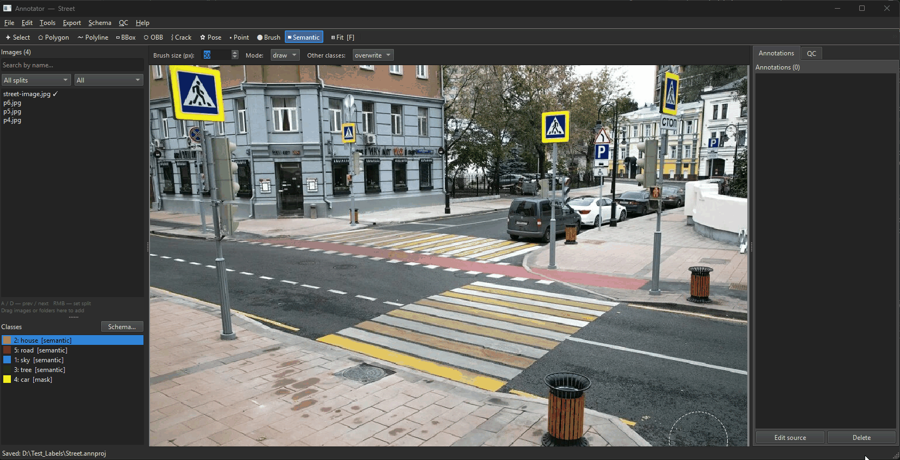
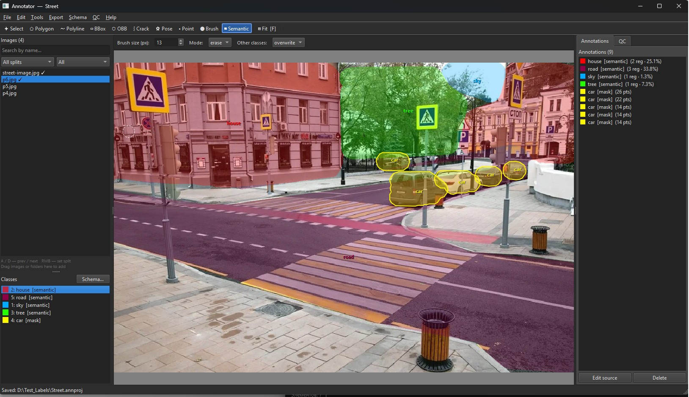
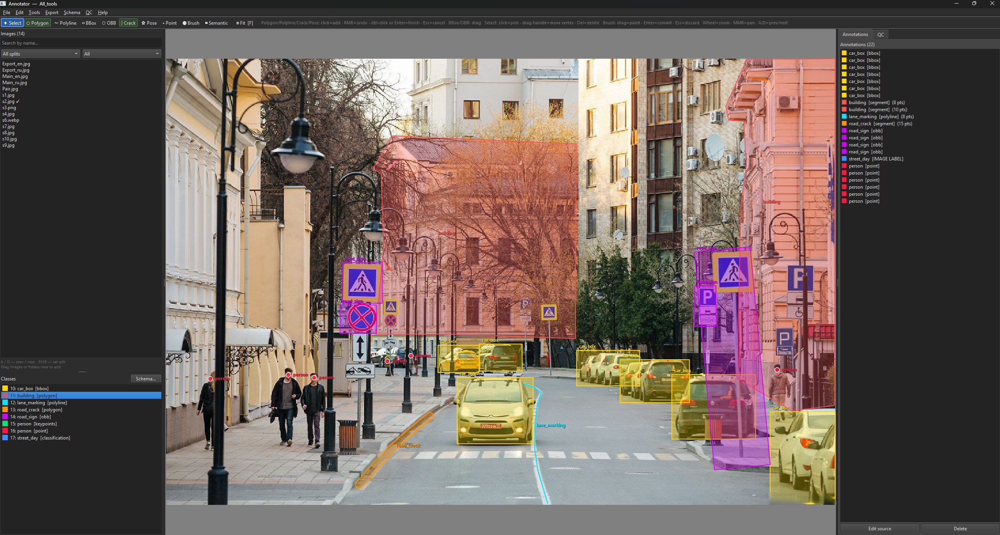
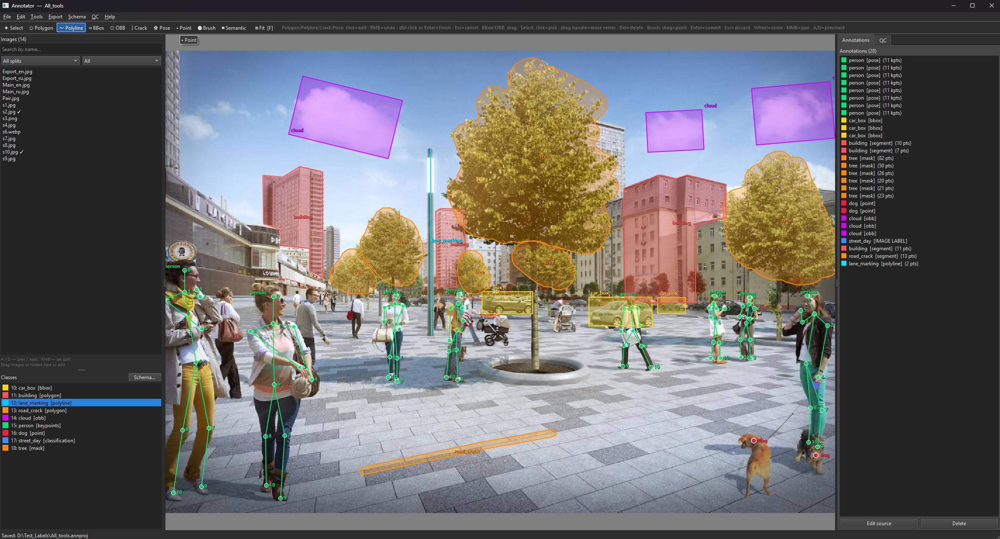
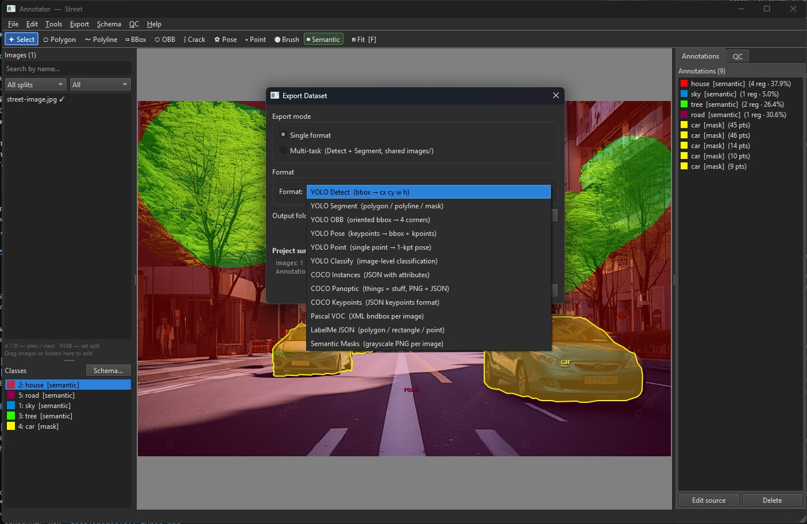
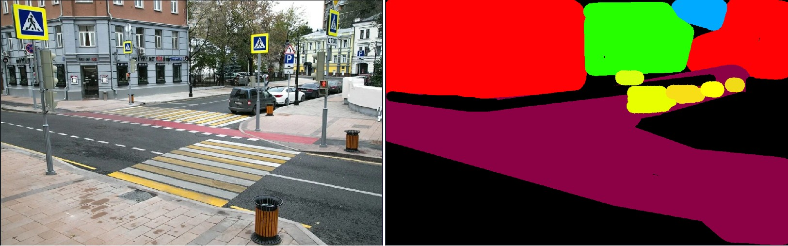

# YOLO Annotator

A desktop image annotation tool for preparing training datasets for computer vision tasks — detection, instance / semantic / panoptic segmentation, OBB, pose estimation, and classification.



*The Semantic brush (`S`) paints house, sky, trees and road as class regions; the Brush (`M`) then adds the cars as separate instances on top.*

**Download for Windows:** [latest release](https://github.com/ILYAGRISH/yolo-annotator/releases/latest) · unzip → `setup_venv.bat` → `run.bat`

## Screenshots


*Main window — semantic regions (house, sky, trees, road) with car instances on top; the Annotations panel lists every layer and instance.*

| | |
|---|---|
|  |  |
| Boxes (cars), polygons (buildings), polyline (lane marking), Crack tool (road crack), OBB (road signs), points (people) and an image-level label | Keypoint skeletons (people, 11 points), brush masks (trees), OBB (clouds), boxes, polygons and points (dogs) |
|  |  |
| Export dialog — 12 formats, including COCO RLE and COCO Panoptic | Semantic Masks export (color mode) next to the source photo |

## Features

- **9 annotation types**: bounding box, polygon, brush mask, semantic region, OBB, keypoints/pose, polyline, point, classification
- **Semantic mode**: paint classes directly — the brush *is* the class, all strokes of a class merge into one region, every pixel belongs to at most one class
- **Panoptic segmentation**: mark each class as *thing* (instances) or *stuff* (regions) and export both layers together
- **Pre-labelling with your YOLO model**: detect / segment / OBB / pose / classify models label the current image (`Ctrl+L`) or the whole dataset; you review and fix. Runs in a separate ML process — PyTorch never enters the app
- **12 export formats**: YOLO Detect / Segment / OBB / Pose / Point / Classify, COCO Instances (polygons or RLE), COCO Keypoints, COCO Panoptic, Pascal VOC, LabelMe JSON, Semantic Masks
- **Import existing datasets**: load a labeled YOLO dataset (Detect / OBB / Segment / Point / Classify) into any open project — class names resolved automatically from `data.yaml` or `classes.txt`
- **Multi-task export**: shared `images/`, separate label folders for parallel model training
- **Auto-export**: `labels/` updated automatically on every save — no manual export step needed
- **Dataset split**: train / val / test with configurable proportions and shuffle
- **QC validation**: detects empty images, duplicate annotations, tiny polygons — with one-click navigation to each issue
- **Annotation attributes**: custom fields per class (text, number, bool, select) → exported to COCO JSON
- **Multi-user mode**: shared network folder; leader assigns images to annotators via built-in dialog
- **Customizable hotkeys**: reassign any tool or navigation key per project in Project Settings
- **EN / RU localization**: switch language at runtime via Help → Language
- **Plugin system**: drop a `.py` file in `plugins/` — tool appears in the toolbar automatically
- **Full undo / redo** for all annotation operations
- **Recent projects**: File → Open Recent lists the last 10 projects

## Annotation Types

| Type             | Hotkey | Description                                      |
|------------------|--------|--------------------------------------------------|
| Bounding Box     | `B`    | Axis-aligned rectangle — object detection        |
| Polygon          | `P`    | Closed contour — instance segmentation           |
| Polyline         | `L`    | Open line — roads, cables, linear features       |
| OBB              | `O`    | Rotated bbox — aerial images, document detection |
| Keypoints / Pose | `K`    | Named skeleton points with edges                 |
| Point            | `.`    | Single centroid — counting, landmarks            |
| Classification   | —      | Image-level label with no geometry               |
| Brush mask       | `M`    | Pixel-painted binary mask → polygon on commit    |
| Semantic region  | `S`    | Class-painted region; one layer per class/image  |

## Export Formats

| Format           | Output                                      | Notes                                               |
|------------------|---------------------------------------------|-----------------------------------------------------|
| YOLO Detect      | `labels/*.txt`                              | `class cx cy w h` normalised                        |
| YOLO Segment     | `labels/*.txt`                              | polygon vertices; BBOX → 4-corner polygon (8 nums)  |
| YOLO OBB         | `labels/*.txt`                              | 4 corner points TL→TR→BR→BL                         |
| YOLO Pose        | `labels/*.txt`                              | bbox + keypoints `[x y v]`; `kpt_names` in data.yaml|
| YOLO Point       | `labels/*.txt`                              | 1-keypoint pose with 1% synthetic bbox              |
| YOLO Classify    | folder structure                            | `split/<class_name>/image.jpg`                      |
| COCO Instances   | `annotations/instances_<split>.json`        | bbox, segmentation, attributes; masks as polygons or RLE |
| COCO Keypoints   | `annotations/keypoints_<split>.json`        | keypoints in pixels + skeleton edges in category    |
| COCO Panoptic    | `annotations/panoptic_<split>.json` + PNGs  | things + stuff; segment id = R + 256·G + 256²·B     |
| Pascal VOC       | `Annotations/*.xml`                         | `<bndbox>` per object; full VOC directory layout    |
| LabelMe JSON     | `<split>/<stem>.json`                       | LabelMe v5 — polygon, rectangle, linestrip, point   |
| Semantic Masks   | `masks/<split>/<stem>.png` + `classes.txt`  | pixel mask per image; three modes: binary / index / color; stuff below, instances on top |

## Import

Re-annotate or extend an existing labeled dataset without re-creating it from scratch.

**File → Import Dataset…**

| Source format  | What is read                                    |
|----------------|-------------------------------------------------|
| YOLO Detect    | `class cx cy w h` → bounding boxes             |
| YOLO OBB       | 4 corner points → oriented bounding boxes      |
| YOLO Segment   | polygon vertices → instance segmentation masks |
| YOLO Point     | 1-keypoint pose → point annotations            |
| YOLO Classify  | `split/<class_name>/image.jpg` folder structure |

**Class resolution**: class names are read from `data.yaml` (field `names:`) or `classes.txt`. Existing project classes are matched by name; unmatched names create new classes automatically.

**Conflict modes** (when an image already has annotations):
- **Skip** — keep existing, skip the image
- **Replace** — overwrite with imported annotations
- **Merge** — add imported annotations on top of existing ones

## Installation

**On another computer (recommended):** take the ready-to-run [`Deploy/`](Deploy/) folder — download the repository ZIP or sparse-checkout just that folder, then run `setup_venv.bat` once and start the app with `run.bat`. Step-by-step guide: [Deploy/README.md](Deploy/README.md).

**From the development sources:**

```bat
cd new_annotator
install.bat        # creates .venv and installs dependencies (first time)
run.bat            # launch the annotator
```

Or manually:

```bat
cd new_annotator
.venv\Scripts\python main.py
```

**Requirements:** Python 3.13+ · Windows (PyQt6)

**Optional ML environment** (for model features — YOLO pre-labelling): `setup_ml_env.bat` creates a separate `.venv-ml` with PyTorch (CUDA build when an NVIDIA GPU is found, `--cpu` otherwise) and Ultralytics. Or point **ML → ML Settings…** at any existing Python / conda environment that has `ultralytics`. The annotator itself never imports PyTorch.

## Changelog

### v1.7 — 2026-10-08
- **Pre-labelling with your YOLO model** — **ML → Pre-label Dataset…** (`Ctrl+Shift+L`) runs any Ultralytics model (detect, segment, OBB, pose, classify) over all images or one split, with a progress bar and Stop; **Ctrl+L** pre-labels the current image (one Ctrl+Z undoes it). Model classes are mapped onto project classes automatically by name, by hand in a searchable table, or **created** with the right type — the selected ones or all missing at once (a 17-point pose model gets the COCO skeleton; the empty default `object` class of a new project is replaced, so class ids start at 0). The *target class* decides the geometry: a segmentation model can fill polygon **or** brush-mask classes, a detector box / OBB / point classes. Images that already have annotations can be skipped, have their earlier model annotations replaced (manual ones kept) or be added to. Model annotations are marked **🤖 0.87** (confidence) in the Annotations panel; **ML → Remove Model Annotations…** clears them on one image or everywhere. In multi-user projects only the images assigned to you are touched. ~25 ms per image on an RTX 5060 Ti
- **ML backend (infrastructure)** — models will run in a **separate process with its own Python environment**, so PyTorch never enters the annotator and a crash or out-of-memory in a model cannot take the app down. New **ML** menu and **ML Settings…** dialog: choose the interpreter (`.venv-ml` by default, or any conda / venv with Ultralytics), **Check** it (Python, PyTorch, Ultralytics, GPU) and test-load a YOLO model (task + class list). Status-bar indicator *ML: off / ready / busy / error*. Off by default — nothing starts until you use it. `setup_ml_env.bat` creates `.venv-ml` (PyTorch with CUDA 12.8, verified on RTX 50xx)

### v1.6 — 2026-10-08
- **Shift+click straight lines** in Brush and Semantic brush (Photoshop-style): a straight stroke from the end of the previous one, chainable, with a dashed guide while Shift is held
- **Pose keypoints can be dragged** with the Select tool (nearest keypoint is picked, visibility kept)
- **Fix** — the Annotations panel showed a meaningless "(0 pts)" for masks, boxes, OBBs, points and poses
- **Fix** — crash when clicking a keypoint of a selected pose (`'PoseAnnotationItem' object has no attribute 'handle_at'`)
- **Fix** — a pose could not be selected where two keypoints overlap (e.g. head and neck)
- **Fix** — dragging a vertex or handle with Select erased the annotation's attributes and subclass
- **Fix** — crash in the Schema editor when deleting the last class in the list; deleting or moving a class could also copy unsaved skeleton edges into its neighbour

### v1.5 — 2026-10-03
- **Semantic mode** — new class type `semantic` and **Semantic brush** tool (`S`): paint a class directly, all strokes of the class merge into a single region layer per image (stored as a PNG). Each stroke is committed on mouse release and undone in one step. Layers never overlap: *overwrite* takes pixels from other classes, *keep* paints only into unlabeled pixels, *erase* unlabels pixels of every semantic class. Semantic layers render pixel-exact (holes and disconnected parts included) underneath instance annotations
- **Panoptic segmentation** — per-class **Panoptic role** (`auto` / `thing` / `stuff`) in the Class Schema Editor; `auto` treats semantic classes as stuff and everything else as things
- **COCO Panoptic export** — `annotations/panoptic_<split>.json` + one RGB PNG per image; stuff classes merge into one segment per image, every thing annotation is its own segment, things are drawn over stuff
- **COCO Instances: "Masks as" option** — export brush masks and semantic layers as **polygons** or pixel-exact **RLE** (holes preserved); RLE is written in the pycocotools format without adding pycocotools as a dependency
- **Exports now handle every region of a mask** — Semantic Masks renders brush masks and semantic layers from their PNG; YOLO Segment, COCO and LabelMe emit one polygon per connected region
- **Unused mask cleanup** — on project open, mask PNGs no longer referenced by any annotation are moved to `masks/_orphaned/` (only if older than 24 h) and deleted on the next open
- **File → Open Recent** — the last 10 projects; the Open dialog starts in the folder of the last one
- **Brush size ring** — a dashed circle under the cursor shows the brush size for both Brush and Semantic brush
- **Deploy folder** — ready-to-run copy with `setup_venv.bat` / `run.bat`; dependency versions pinned
- **License** — the project is now released under GPL-3.0
- **Fixes** — brush masks were missing from COCO Instances export; OBB rotation was ignored in COCO export; YOLO Detect with the *Convert* policy crashed on brush masks; the Annotations panel was emptied after editing the class schema; `requirements.txt` was missing NumPy and OpenCV

### v1.4
- **Semantic Masks export** — pixel-level mask PNG per image alongside the original; three modes: **Binary** (0/255, single label), **Index** (0/1/2… by class order), **Color** (RGB, each class in its project color); `classes.txt` legend included; supports brush masks, polygons, bboxes, OBB, and polylines (adaptive thickness — useful for crack annotations)

### v1.3
- **YOLO dataset import** — load an existing labeled dataset into any open project via File → Import Dataset…; supports Detect, OBB, Segment, Point, and Classify formats; class names resolved automatically from `data.yaml` or `classes.txt`; three conflict modes (skip / replace / merge) for images that already have annotations

### v1.2
- **Pascal VOC export** — full XML `<bndbox>` export with `Annotations/`, `JPEGImages/`, `ImageSets/Main/` layout; all geometry types converted to bounding box
- **LabelMe JSON export** — LabelMe v5 format with full geometry (polygon, rectangle, linestrip, point); output grouped by split
- **Customizable hotkeys** — reassign any tool or navigation key in Project Settings → Hotkeys; stored per project, applied instantly
- **EN / RU localization** — switch language at runtime via Help → Language; menus, panels, buttons, filters, and dialogs all update immediately

### v1.1
- **Subclass selector** — when annotating, a combobox appears in the Annotations panel to assign a subclass to any annotation (subclasses are defined per class in the Class Schema Editor)
- **Drag & drop images** — drag image files or folders directly onto the Images panel to add them to the project
- **Image filters** — search by filename, filter by split (train / val / test) and annotation status (All / Annotated / Unannotated); header shows `Images (N / total)` when a filter is active

### v1.0
- Initial release

## Tech Stack

- **UI**: PyQt6 ≥ 6.4
- **Geometry**: shapely ≥ 2.0 (buffering, IoU, area)
- **Image I/O**: Pillow ≥ 9.0, OpenCV 4.13, NumPy
- **Runtime**: Python 3.13, fully offline — no cloud dependencies
- **Storage**: `.annproj/` directory — JSON metadata + PNG masks

## Project Structure

```
new_annotator/
├── annotator/
│   ├── domain/       ← data model  (Project, LabelClass, Annotation)
│   ├── storage/      ← project load/save
│   ├── exporters/    ← one module per export format
│   ├── tools/        ← annotation tools (base + built-in)
│   ├── ui/           ← PyQt6 widgets, panels, dialogs
│   ├── controller/   ← ProjectController (MVC)
│   └── ml/           ← ML extension: backend client, ML menu, settings (optional)
├── ml_backend/       ← ML server, runs in .venv-ml (PyTorch, Ultralytics) as a child process
├── plugins/          ← custom tool plugins (*.py)
├── docs/             ← About.md, hotkeys.md, Test_Help.md
├── setup_ml_env.bat  ← creates the optional .venv-ml
├── build_deploy.py   ← refreshes ../Deploy from these sources
└── main.py

Deploy/               ← ready-to-run copy for other computers
├── setup_venv.bat    ← creates .venv and installs requirements
├── run.bat           ← starts the app
└── About.md          ← user guide (RU)
```

## License

[GPL-3.0](LICENSE) — free to use, modify and redistribute; derivative works must stay open source under the same license.
The UI is built on PyQt6, which is itself licensed under GPL-3.0.
